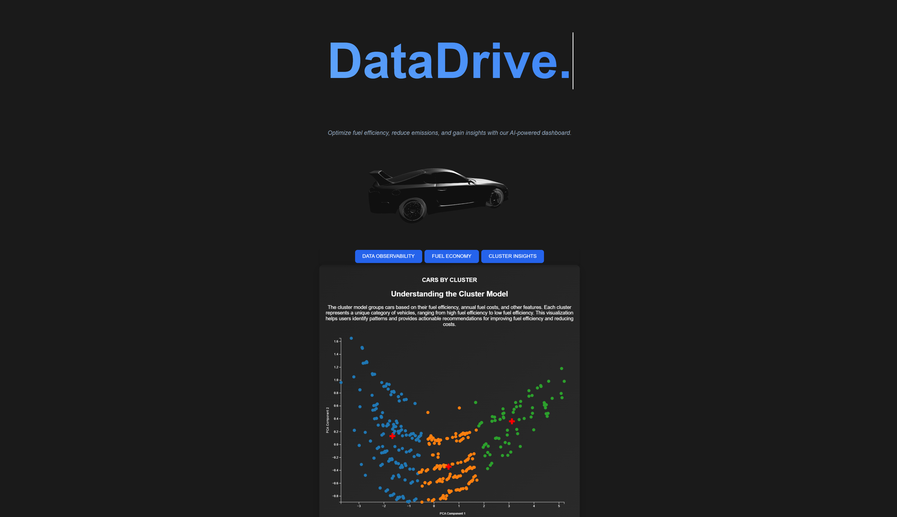

# DataDrive: Unified Insights for Data & Fuel Optimization

DataDrive is a full-stack platform that combines **AI-powered insights** with **fuel optimization** and **data observability**. It leverages machine learning models to monitor inefficiencies, predict fuel consumption, and calculate environmental impacts, while offering actionable recommendations via a dynamic and intuitive dashboard.



## **Features**
- Predict **fuel efficiency** based on vehicle parameters.
- Cluster vehicles into efficiency categories using K-Means and visualize with **D3.js**.
- Provide **SHAP-based explanations** for ML model predictions.
- **Real-time insights** with API endpoints powered by Flask.
- Interactive **3D car model** and PCA-based visualizations.
- **IPFS-backed secure logging and reporting**.

---

## **Tech Stack**
### **Frontend**
- **Framework:** [Vite](https://vitejs.dev/) (React + TypeScript)
- **Styling:** TailwindCSS, D3.js
- **3D Modeling:** React-Three-Fiber
- **Visualization:** Chart.js, D3.js

### **Backend**
- **Framework:** Flask (Python)
- **ML Models:** scikit-learn, TensorFlow
- **Job Scheduling:** APScheduler

---

## **Local Setup**

### Prerequisites
Ensure the following tools are installed:
- **Python** (3.8 or later)
- **Node.js** (16.x or later)
- **Yarn** (or npm)

### **Step 1: Clone the Repository**
```bash
git clone https://github.com/kushagrabharti/DataDrive.git
cd DataDrive
```

### **Backend Setup & Local Env Initialization**

```bash
cd backend

# Virtual Env. for Python
python3 -m venv venv
source venv/bin/activate  # macOS/Linux
.\venv\Scripts\activate   # Windows

# Install dependencies
pip install -r requirements.txt

# Running FLASK server
python app.py
```

### **Frontend Setup & Local Env Initialization**

```bash
cd frontend
yarn install
yarn vite dev
```